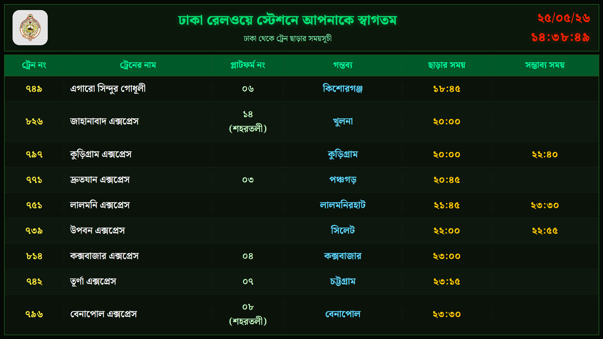
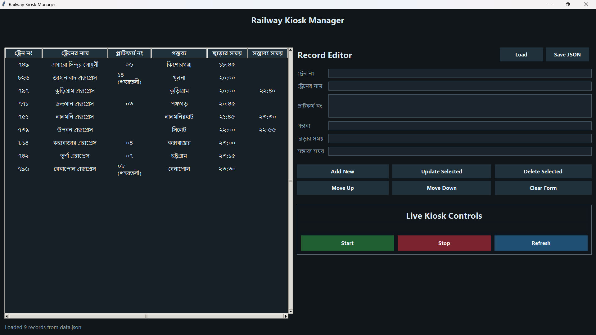

# Railway Kiosk Manager

Desktop manager and kiosk launcher for a railway timetable display.

| Kiosk | Manager |
| --- | --- |
|  <br> Kiosk view |  <br> Manager view |

## Overview

This project provides a small Windows application for maintaining train timetable data and launching the public display in Microsoft Edge kiosk mode.

It includes:

- a desktop manager for editing train records
- JSON-based data storage in `data.json`
- kiosk start, stop, and refresh controls
- a full-screen Edge display optimized for kiosk use

## Repository Layout

- `index.html` - kiosk display page
- `data.json` - train data source used by the kiosk
- `kiosk_manager.py` - desktop manager for editing data and controlling kiosk mode
- `launch-manager.cmd` - double-click launcher for the manager

## Requirements

- Windows 10 or Windows 11
- Microsoft Edge
- Python 3
- Python launcher (`py`)

## Setup

1. Clone or download the repository.
2. Confirm that Python 3 is installed and the `py` launcher is available.
3. Confirm that Microsoft Edge is installed.

No additional Python packages are required.

## Running the Manager

### Option 1: Double-click

Open `launch-manager.cmd`.

### Option 2: Command line

```powershell
py -3 kiosk_manager.py
```

## Usage

1. Open the manager.
2. Edit the train records in the Record Editor.
3. Use the record actions to add, update, delete, or reorder entries.
4. Click **Save JSON** to write the updated data to `data.json`.
5. Click **Start** to open the kiosk display in Edge.
6. Use **Refresh** to show saved changes in the running kiosk.
7. Use **Stop** to close the kiosk.

## Notes

- The kiosk display is designed for kiosk mode and shows the first 9 rows in view.
- The platform field supports multiple lines in the manager and is stored in JSON using `<br>` separators.
- When the kiosk is running, the Start button shows a running state and the Stop button is disabled until the kiosk is active.
- In kiosk mode, the display is full-screen and is meant for keyboard control, not mouse interaction.

## Returning to the Manager

- If the kiosk is running and you want to go back to the manager, press `Alt + Tab` to switch windows.
- If the kiosk is still open and the manager is available, you can use **Stop** in the manager to close the kiosk window.
- Pressing the Windows key may show the taskbar, but kiosk mode is still meant to be controlled from the keyboard.

## Troubleshooting

- If the kiosk does not start, make sure Microsoft Edge is installed.
- If the manager does not open, make sure Python 3 and the `py` launcher are installed.
- If updated data does not appear in the kiosk, save the JSON first and then use Refresh.
- If you need to exit the kiosk window itself, press `Alt + F4`.
- If the manager is still open, you can also use **Stop** there instead of closing the kiosk directly.